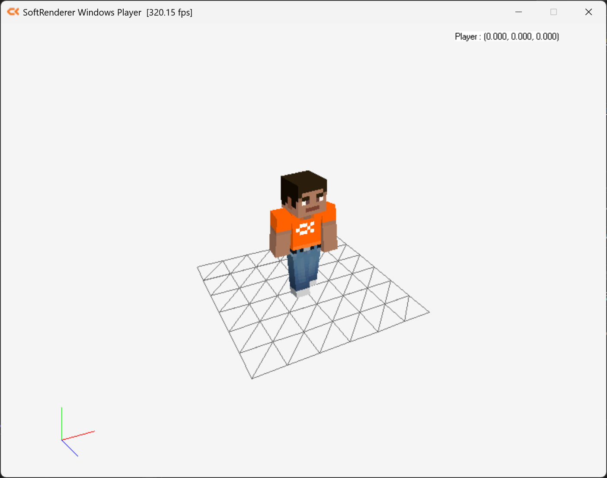

## 게임 개발을 위한 수학

---
---
 

### 이득우의 게임수학

▲ 이득우의 게임수학 1권

### 1. 벡터 (Vector)

벡터는 **크기(Magnitude)**와 **방향(Direction)**을 가진 수학적 객체입니다. 게임에서는 주로 위치, 속도, 힘, 방향 등을 표현하는 데 사용됩니다.

#### 1.1 벡터의 정의

- **2차원 벡터**: $(x, y)$ 또는 $\begin{pmatrix} x \\ y \end{pmatrix}$
- **3차원 벡터**: $(x, y, z)$ 또는 $\begin{pmatrix} x \\ y \\ z \end{pmatrix}$

#### 1.2 벡터의 연산

**1. 덧셈과 뺄셈**

두 벡터를 더하거나 빼는 것은 각 성분을 더하거나 빼는 것과 같습니다.

$$ \begin{pmatrix} x_1 \\ y_1 \end{pmatrix} + \begin{pmatrix} x_2 \\ y_2 \end{pmatrix} = \begin{pmatrix} x_1 + x_2 \\ y_1 + y_2 \end{pmatrix} $$

**2. 스칼라 곱셈**

벡터에 스칼라(실수)를 곱하면 벡터의 크기가 변합니다.

$$ k \begin{pmatrix} x \\ y \end{pmatrix} = \begin{pmatrix} kx \\ ky \end{pmatrix} $$

**3. 벡터의 크기 (Magnitude)**

피타고라스 정리를 이용하여 벡터의 크기를 계산합니다.

$$ |\mathbf{v}| = \sqrt{x^2 + y^2 + z^2} $$

**4. 단위 벡터 (Unit Vector)**

크기가 1인 벡터로, 방향만 나타낼 때 사용합니다.

$$ \mathbf{\hat{v}} = \frac{\mathbf{v}}{|\mathbf{v}|} $$

#### 1.3 벡터의 내적 (Dot Product)

두 벡터의 내적은 두 벡터가 이루는 각도의 코사인 값과 관련이 있습니다.

$$ \mathbf{a} \cdot \mathbf{b} = |\mathbf{a}| |\mathbf{b}| \cos\theta = a_x b_x + a_y b_y + a_z b_z $$

**활용 예시**:

- 두 벡터 사이의 각도 계산
- 두 벡터가 같은 방향인지, 반대 방향인지 판별
- 빛의 세기 계산 (코사인 값에 따라)

#### 1.4 벡터의 외적 (Cross Product)

3차원 벡터에서만 정의되며, 두 벡터에 모두 수직인 새로운 벡터를 생성합니다.

$$ \mathbf{a} \times \mathbf{b} = \begin{pmatrix} a_y b_z - a_z b_y \\ a_z b_x - a_x b_z \\ a_x b_y - a_y b_x \end{pmatrix} $$

**활용 예시**:

- 법선 벡터(Normal Vector) 계산
- 회전축 결정
- 토크(Torque) 계산

#### 1.5 벡터의 투영 (Projection)

한 벡터를 다른 벡터 위에 투영하여 그림자를 구하는 연산입니다.

$$ \text{proj}_\mathbf{b} \mathbf{a} = \frac{\mathbf{a} \cdot \mathbf{b}}{|\mathbf{b}|^2} \mathbf{b} $$

**활용 예시**:

- 그림자 계산
- 벡터를 특정 방향으로 분해
- 충돌 판정

#### 1.6 벡터의 외적 (Cross Product)

3차원 벡터에서만 정의되며, 두 벡터에 모두 수직인 새로운 벡터를 생성합니다.

$$ \mathbf{a} \times \mathbf{b} = \begin{pmatrix} a_y b_z - a_z b_y \\ a_z b_x - a_x b_z \\ a_x b_y - a_y b_x \end{pmatrix} $$

**활용 예시**:

- 법선 벡터(Normal Vector) 계산
- 회전축 결정
- 토크(Torque) 계산

#### 1.7 벡터의 투영 (Projection)

한 벡터를 다른 벡터 위에 투영하여 그림자를 구하는 연산입니다.

$$ \text{proj}_\mathbf{b} \mathbf{a} = \frac{\mathbf{a} \cdot \mathbf{b}}{|\mathbf{b}|^2} \mathbf{b} $$

**활용 예시**:

- 그림자 계산
- 벡터를 특정 방향으로 분해
- 충돌 판정

#### 1.8 벡터의 외적 (Cross Product)

3차원 벡터에서만 정의되며, 두 벡터에 모두 수직인 새로운 벡터를 생성합니다.

$$ \mathbf{a} \times \mathbf{b} = \begin{pmatrix} a_y b_z - a_z b_y \\ a_z b_x - a_x b_z \\ a_x b_y - a_y b_x \end{pmatrix} $$

**활용 예시**:

- 법선 벡터(Normal Vector) 계산
- 회전축 결정
- 토크(Torque) 계산

#### 1.9 벡터의 투영 (Projection)

한 벡터를 다른 벡터 위에 투영하여 그림자를 구하는 연산입니다.

$$ \text{proj}_\mathbf{b} \mathbf{a} = \frac{\mathbf{a} \cdot \mathbf{b}}{|\mathbf{b}|^2} \mathbf{b} $$

**활용 예시**:

- 그림자 계산
- 벡터를 특정 방향으로 분해
- 충돌 판정

#### 1.10 벡터의 외적 (Cross Product)

3차원 벡터에서만 정의되며, 두 벡터에 모두 수직인 새로운 벡터를 생성합니다.

$$ \mathbf{a} \times \mathbf{b} = \begin{pmatrix} a_y b_z - a_z b_y \\ a_z b_x - a_x b_z \\ a_x b_y - a_y b_x \end{pmatrix} $$

**활용 예시**:

- 법선 벡터(Normal Vector) 계산
- 회전축 결정
- 토크(Torque) 계산

#### 1.11 벡터의 투영 (Projection)

한 벡터를 다른 벡터 위에 투영하여 그림자를 구하는 연산입니다.

$$ \text{proj}_\mathbf{b} \mathbf{a} = \frac{\mathbf{a} \cdot \mathbf{b}}{|\mathbf{b}|^2} \mathbf{b} $$

**활용 예시**:

- 그림자 계산
- 벡터를 특정 방향으로 분해
- 충돌 판정

#### 1.12 벡터의 외적 (Cross Product)

3차원 벡터에서만 정의되며, 두 벡터에 모두 수직인 새로운 벡터를 생성합니다.

$$ \mathbf{a} \times \mathbf{b} = \begin{pmatrix} a_y b_z - a_z b_y \\ a_z b_x - a_x b_z \\ a_x b_y - a_y b_x \end{pmatrix} $$

**활용 예시**:

- 법선 벡터(Normal Vector) 계산
- 회전축 결정
- 토크(Torque) 계산

#### 1.13 벡터의 투영 (Projection)

한 벡터를 다른 벡터 위에 투영하여 그림자를 구하는 연산입니다.

$$ \text{proj}_\mathbf{b} \mathbf{a} = \frac{\mathbf{a} \cdot \mathbf{b}}{|\mathbf{b}|^2} \mathbf{b} $$

**활용 예시**:

- 그림자 계산
- 벡터를 특정 방향으로 분해
- 충돌 판정

#### 1.14 벡터의 외적 (Cross Product)

3차원 벡터에서만 정의되며, 두 벡터에 모두 수직인 새로운 벡터를 생성합니다.

$$ \mathbf{a} \times \mathbf{b} = \begin{pmatrix} a_y