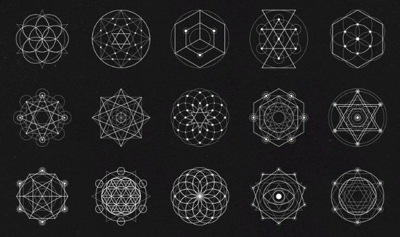

## 프로젝트, **STAR KEEPER: The Architect of Starlight**

---
---
 

### 기하학 도형을 활용해볼 수 있을까?

간단한 도형만으로 비주얼을 챙기려면 게임의 구조가 참신하고 탄탄해야 한다고 생각했다.

그럼 어떻게 해야할까 고민중에 "Super Hexagon"이라는 게임도 생각났고, 우주의 별자리는 어떻게 생겼었지? 라는 생각도 하면서
별자리가 만들어졌을 때 기억하기 쉽게 흩어져 있는 별들을 익숙한 모양으로 이어 만들어졌다고 했으니 나도 그렇게 한번 해볼까?

근데 너무 불규칙적이면 랜덤한 요소가 너무 많이 들어가니까 별자리에 규칙을 만들고 기하학적인 도형 모양으로 해보면 어떨까? 생각을 했다.

기하학적인 도형은 아주 간단한 선과 점만 사용해서 만들어지기 때문에 1인개발에서 충분히 구현할 수 있다고 생각했다.

하지만 기하학적인 도형만으로는 재밌는 게임을 만들기에는 너무 단순해 보였다.

그래서 뱀파이어 서바이벌 같은 느낌을 같이 넣으면 좋을 것 같았다. 가운데 에너지원으로 무수히 날아오는 소행성.

그걸 막기 위해 휴면성에서 에너지를 방출하고, 에너지원과 휴면성을 이은 빔도 무기가 된다.

그리고 에너지원의 성장에 따라 추가적인 요소들을 추가한다면 충분히 재밌는 게임이 될 것 같았다.

#### 그렇게 STAR KEEPER가 탄생하게 되었다.

 ▲참고했던 기하학 도형들

### 