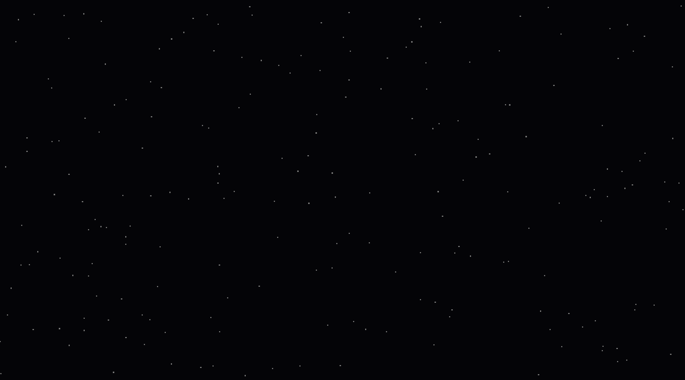
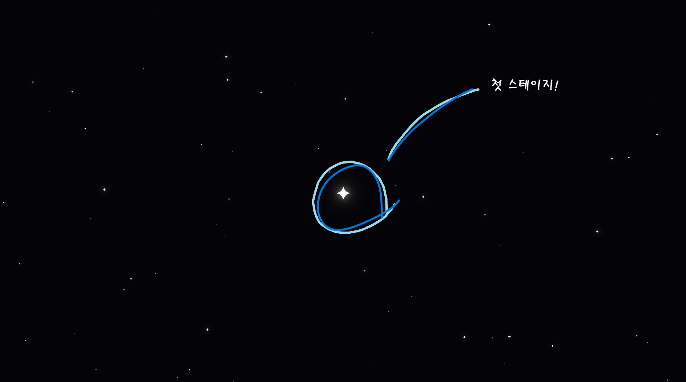
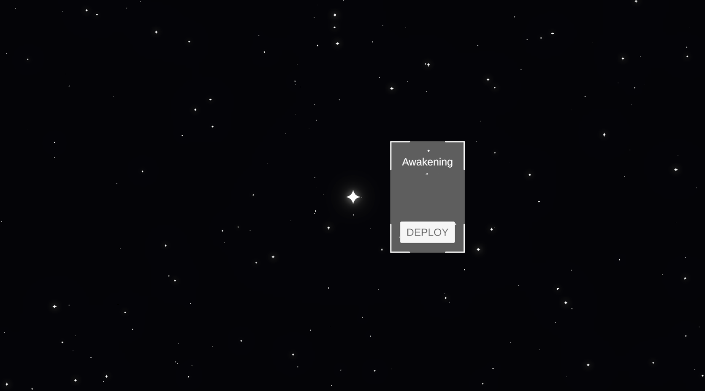

## 프로젝트, **STAR KEEPER: The Architect of Starlight**

---
---
<br>

### WorldMap System 재구성
---
<br>

#### WorldMap System이란?

WorldMap System은 STAR KEEPER의 핵심 시스템으로, <br>플레이어가 우주를 탐험하며 별자리를 복원하는 게임의 기반이 되는 시스템이다.

#### WorldMap System을 재구성하여 파티클 및 렌더링 최적화를 했다.

이전에는 파티클 시스템에 Material 부분에 유니티 기본 파티클을 사용했으나, <br>렌더링 최적화를 위해 URP의 Shader Graph를 사용하여 파티클 시스템을 재구성했다.

파티클을 스프라이트로 제작하여 기존의 네모난 별들에 모양을 부여하고 현실감을 더했다.

제작한 스프라이트를 유니티 내에서 새로운 Material로 변환하였다.<br>
**１）Material의 Base Map에 제작한 스프라이트를 할당하고, <br>
***Surface Type = Transparent***, ***Blending Mode = Additive***로 설정했다.**

**２）파티클 간의 랜덤한 크기 조절을 위해 Particle의 Main 모듈의<br>
***Start Size***를 ***Random Between Two Constants***로 설정하고 0.01 에서 0.2 사이로 정했다.**

**３）파티클의 반짝임을 설정하기 위해 ***Size over Lifetime*** 모듈을 사용하여<br>
파티클을 일정 주기로 반짝이게 만들었다.**

**４）화면 밖의 파티클을 멈추기 위해 Main 모듈의 ***Culling Mode***를 ***Pause and Catch-up***으로 설정했다.**


<br>▲이전 파티클


<br>▲이후 파티클

##### 파티클 시스템 변경 후 확실히 부드러워지고 이뻐졌다!

!!! 하지만 화면을 줌인하면 파티클이 너무 커져서 별자리가 잘 보이지 않는 문제가 발생했다.

이를 해결하기 위해 파티클의 크기를 화면의 줌 레벨에 따라 조절하는 기능을 추가했다.

```csharp
// 줌 수치에 따른 파티클 크기(Start Size) 동적 조절
// 현재 줌(OrthographicSize)이 커질수록(줌 아웃) 별의 기본 크기도 조금씩 키워줘.
float currentZoom = virtualCamera.Lens.OrthographicSize;

// 계산식: 기본 크기 + (현재 줌 * 가중치)
float dynamicMin = minStartSize + (currentZoom * sizeMultiplier);
float dynamicMax = maxStartSize + (currentZoom * sizeMultiplier);

// 파티클 시스템의 Start Size를 두 상수 사이의 랜덤값으로 설정
main.startSize = new ParticleSystem.MinMaxCurve(dynamicMin, dynamicMax);
```

그리고 메인 스테이지를 상징하는 첫번째 스테이지 별을 추가했다.


<br>▲메인 스테이지

스테이지 별을 추가하면서 마우스 호버 시 별이 커지는 기능과 빛나는 효과를 추가했다.

```csharp
public void OnPointerEnter(PointerEventData eventData)
{
    DOTween.To(() => _currentBaseIntensity, x => SetIntensity(x), hoverIntensity, animationDuration);
    visualGroup.DOScale(0.3f, animationDuration).SetEase(Ease.OutBack);
}

public void OnPointerExit(PointerEventData eventData)
{
    DOTween.To(() => hoverIntensity, x => SetIntensity(x), _currentBaseIntensity, animationDuration);
    visualGroup.DOScale(0.2f, animationDuration);
}
```
<br>

#### 그 후에 스테이지를 클릭했을 때 그 스테이지의 정보를 보여주는 정보창을 추가해보았다!

정보창은 Figma로 직접 제작하여 유니티로 가져왔다.


<br>▲스테이지 정보창

**이번에는 ***UpdateTooltipPosition*** 함수를 사용하여 <br>별의 위치를 화면 좌표로 변환하여 정보창의 위치를 별의 위치로 이동시켰다.**<br>

**그리고 ***ShowTooltip*** 함수를 사용하여 정보창을 화면에 표시했다.**

```csharp
public void ShowTooltip(StageData data, Transform starTransform)
{
    _targetStar = starTransform;
    titleText.text = data.stageName;

    // 초기 위치 설정 및 나타나기 연출
    UpdateTooltipPosition();
    tooltipPanel.gameObject.SetActive(true);

    _canvasGroup.alpha = 0;
    _canvasGroup.DOFade(1, 0.2f);
    tooltipPanel.DOPunchPosition(Vector3.up * 10, 0.3f, 5);
}
private void UpdateTooltipPosition()
{
    // 1. 별의 월드 좌표를 화면 좌표로 변환
    Vector3 screenPos = Camera.main.WorldToScreenPoint(_targetStar.position);

    // 2. UI 좌표계에 맞게 오프셋을 더해줌
    tooltipPanel.position = screenPos + (Vector3)offset;
}
```