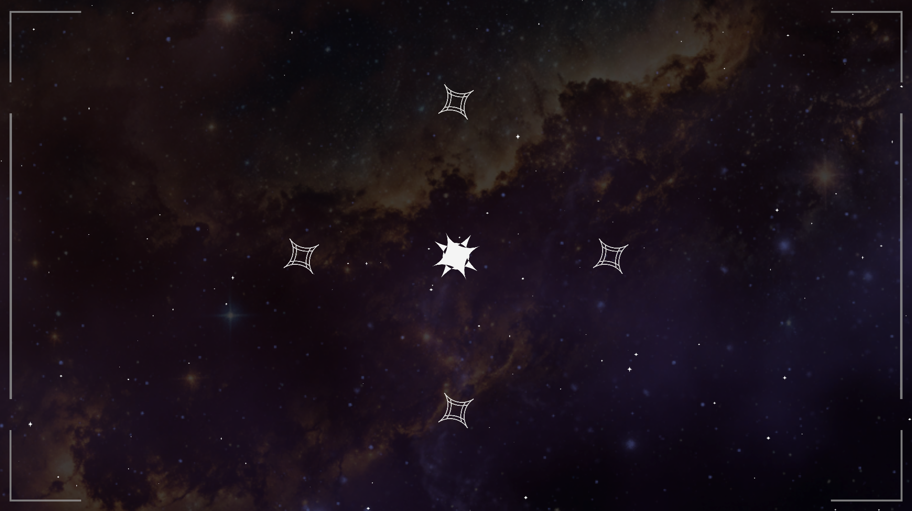
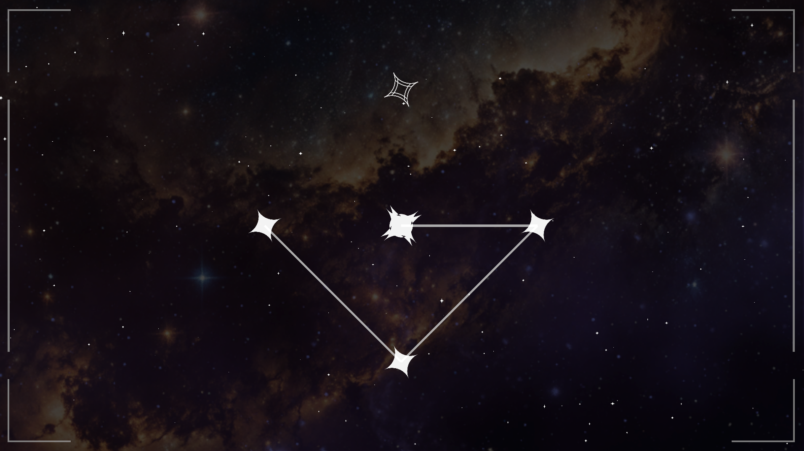

## 프로젝트, **STAR KEEPER: The Architect of Starlight**

---
---
<br>

**이제 드디어 이 게임의 핵심 루프를 만들어 볼 것이다!!**

기본적으로 WorldMapScene에서 스테이지 노드를 클릭하여 나오는 플레이 버튼을 누르면 GameScene으로 이동하는 로직부터 만들었다.

**사용한 함수는***LoadScene***함수를 사용하여 GameScene을 불러오는 방식이다**

```csharp
public void LoadGameScene(StageData stage)
{
    selectedStage = stage;
    // "CombatScene"은 나중에 만들 전투용 씬 이름이야
    SceneManager.LoadScene("GameScene");
}
```
<br>
GameScene으로 이동하면 Scriptable Object에 저장된 스테이지 데이터를 불러와서 게임을 시작한다.

```csharp
void Start()
{
    if (GameManager.Instance != null && GameManager.Instance.selectedStage != null)
    {
        SetupStage(GameManager.Instance.selectedStage);
    }
}
```
<br>
일단 GameScene 배경이 너무 밋밋해서 WorldMapScene의 배경을 가져와서 사용했고, 카메라 줌 인, 줌 아웃 기능과 카메라 이동 기능도 전부 그대로 가져왔다.

**그리고 내가 설정한 대로 별이 배치 되어있는 모습이다!!**


<br> ▲ GameScene 화면

중앙의 별은 PrimeStar이고, 에너지를 담고 있다.

주변의 별은 DormantStar로 에너지를 받으면 활성화되면서 날아오는 소행성을 막아내는 역할을 한다.

**다음으로는 별자리를 연결할 수 있는 선을 그려 보았다.**
**LineRenderer를 사용하여 별과 별을 연결하는 에너지 빔을 그렸다.**

에너지 빔의 출발 지점을 정하고, 에너지 빔을 끌고 가서 연결하면 별자리가 완성되는 방식인데, 처음에 구현했을 때 작동을 안해서 한참 헤맸다.

**DormantStar에 붙어있는 스크립트에 마우스를 올렸을 때나, 클릭했을 때 그 상황을 전달해주는 전달인자가 필요했는데**<br>
**이런식으로 클래스를 선언할 때 IPointerDownHandler, IPointerEnterHandler, IPointerExitHandler 따로 인자를 모두 전달해줘야 했다.**

**그렇게 에너지 빔의 연결 방식을 구현 완료했다!**


<br> ▲ 에너지 빔 연결완료!

에너지를 받기 전에는 DormantStar가 비활성화 되어있다가, 에너지를 받으면 활성화되면서 스프라이트를 바꾸는 로직을 추가했다.

별 모양 스프라이트가 맘에 안들어서 나중에 다시 제작해야 할 것 같다....(너무 단순해서 안 어울리는 느낌..?)

```csharp
public void ActivateStar()
{
    if (isActive) return;

    isActive = true;
    _spriteRenderer.sprite = activeSprite;
}
```

