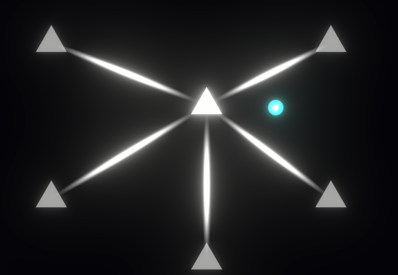

## 프로젝트, **STAR KEEPER: The Architect of Starlight**

---
---
 

### 이 프로젝트는 "Mini Motorways"라는 게임을 보고 감명을 받아 기획을 시작했다.

어느 날 유튜브에서 한 유튜버가 Mini Motoyways라는 게임을 플레이 하는걸 봤는데 생각보다 너무 재밌어 보였다.

내가 봤던 유튜브 -> https://www.youtube.com/watch?v=fTeVB2Dr_AE

보는 재미가 있다고 해야하나.. 물론 내가 직접 플레이 해보지는 않았지만, 엄청나게 매력적인 게임인 건 확실해 보였다.

 ▲ Mini Motorways 인게임 사진

생각보다 간단한 게임 플레이 방식으로도 이런 몰입감과 성취감을 줄 수 있다는 점이 인상깊었다.  그렇다면 이 게임을 내 방식으로는 어떻게 표현을 해야할 지 고민을 해봤다.

예전부터 우주에 관심도 많고 밤하늘의 별을 보면서 나중에 게임으로 만들고 싶다는 생각을 했었는데 이걸 이용하면 비슷하게 만들 수 있지 않을까? 라는 생각이 스쳐 지나갔다.

처음부터 우주를 배경으로 할 생각은 아니었다. 그냥 지구가 아닌 다른 행성에서 진행되는 Mini Motorways를 만들고 싶었다. 

기획을 처음 시작하고 핵심 루프를 어떻게 만들어야 할 지 고민을 굉장히 많이 했다. Mini Motorways와 어떤 차별점을 줄 수 있을까 고민을 많이 했다.

그래서 나온게 
**'Mini Motoyways의 진행 방식을 거꾸로 해보자!'**
였다. Mini Motorways는 도로를 확장하여 여러 작은 집에서 큰 건물까지 연결해주는 게임이지만, 내 게임은 큰 에너지 원에서 불이 꺼진 작은 곳에 에너지를 공급해주는 방식으로 해보자라는 생각으로 기획을 쭉 진행했다.

그렇게 쭉 진행을 하면서 제작을 어느정도 했는데, 제작을 하고 조금씩 플레이를 해보니 이게 생각보다 재밌지도 않았고、이 게임이 나만의 게임이라고 할 수 있나?라는 생각이 문득 들기 시작했다. 이름도 지금의 이름인 STAR KEEPER가 아니라 LINECRAFT 였다.

그냥 Mini Motorways를 우주 버전으로 만든 것 보다 별로라는 느낌이 들었다. 전혀 차별점이라는게 보이지 않았다. 

물론 그래픽 디자인도 정말 별로였다.（ 디자인은 처음이고、초짜니까 그럴 수 있지.. ）

 ▲ 제작했던 LINECRAFT 인게임 사진 ( 진짜 디자인 이게맞니...? )

그래서 이대로는 안되겠다 싶어서 다시 기획을 시작했다.

#### 이 게임과 Mini Motorways의 차별점을 명확하게 두려면 어떤 아이디어가 필요할까?

여러가지 아이디어를 냈었다. 일단 행성 간의 에너지 교환을 기본으로 잡고 내가 좋아하는 우주를 배경으로 해보는 걸로 정했다. 

그 생각 이후 나온 첫번째 아이디어는 **'테라포밍 형식의 게임 느낌을 넣어서 혼합을 해보자!'** 였다. 

에너지를 공급해주면 공급받은 행성 주변에 생기가 돌면서 죽어있던 별을 다시 숨쉬게 한다는 방식이었다.

이 방식도 나름 색다른 느낌이긴 했다. 시간이 지날수록 행성이 생기를 되찾고 마지막에는 아름다운 행성이 완성되는 방식이었다.

어느정도 만들었었는데 사진을 안찍어놨다.. 어쨋든 지금과는 전혀 다른 모습이었다. 나름 Mini Motorways과의 차별점이 있었다.

근데 완성되었을 때의 비주얼과 디자인을 혼자서는 만들어 내기 너무 힘들었다. 이게 1인개발의 한계점이지 않을까.. 물론 시간을 더 쓰면 가능하긴 했을 것 이다.

나름 노력해봤지만 내 맘에 들기에는 역부족이었다. 그래서 결국 또 다시 새로운 아이디어를 모색하기 시작했다.

그렇게 나온 새로운 아이디어는 그래픽 리소스를 최대한 적게 사용할 수 있는 간단한 형식의 도형 리소스만 필요한 
### 지금의 STAR KEEPER가 되었다.

**다음에 계속...**